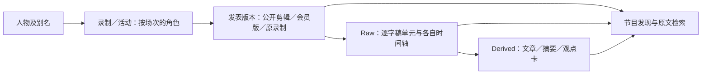

# 对谈资料架构与核对责任

目标是让问问立正找到完整、可回查的节目资料，并区分参与者、实际发言者和观点归属。资料整理者负责调查和纠错；用户无需逐项审核全部人物及字幕。发布时只审阅已经整理好的准确变更。

## 两层内容，共用来源目录

Raw层保存原媒体、字幕、精校副本、发表版本、时间码及具体发言归属。校对产生新副本和修改依据，原稿继续保留。Derived层保存摘要、主题解释、文章、观点卡和AI提炼，每项回指Raw版本及片段。提炼可重建，检索原文无需先生成提炼。

人物、节目、版本与证据是两层共用的来源目录，不能因为是结构化数据就被当成AI观点。目录不保存一个混合的“嘉宾简介+全部发言+立正主张”字段。

人物ID独立于公司、职位和昵称；一次任职变更不会新建人物。同一个录制可以有多个版本，版本有各自时间轴。关联完整稿与剪辑稿不代表可以换用时间码，也不代表允许公开完整稿中的删减段。文章署名、录制主持和发言人分别登记。

## 身份核对由整理者完成

优先检查原节目自我介绍、主持明确的返场／上下期介绍、作者原始描述中的本人链接、制作记录及本人或机构的一手资料。重复同步的网页、嘉宾表和视频维护页脚只算同一条来源断言。官网的新职务与节目当时的自述分别保留日期，不互相覆盖。

视觉检查用于读取姓名牌、Zoom显示名称、字幕、屏幕上的本人链接、剪辑文字和节目格式。宣传封面、插画或没有名字的画面不能提供姓名证据。不能凭外貌合并人物。音频检查优先处理自我介绍、专名、实际换人及关键观点的区间；独立识别与听校记录各自保存，不用模型提交成功替代语义核实。

合并或拆分必须有具体证据、旧ID、新ID和理由。旧姓名、slug、来源断言及URL保留；错误结论另存撤回记录。旧人物ID仍可解析到合并后ID。未知姓名、同名和职位差异本身都不能证明是不同的人。只有确实无法解决、且影响发布或观点归属的事项，才集中请用户判断。

## 检索按证据回答

| 已有依据 | 可以提供的结果 | 继续调查的方法 |
|---|---|---|
| 节目参与关系明确，具体发言人未知 | 按人物找到节目及相关原文，说明片段归属 | 定位自我介绍或带姓名的画面；使用同一录制内的明确说话人标签和换人证据 |
| 某段发言人明确 | 引用该人的实际原话和该版本时间码 | 核对该段是否在提问、转述、假设或引用别人 |
| 发言人及表达含义已核 | 回答“嘉宾怎么看”或“立正怎样判断”，保留条件 | 必要时查前后文、同题返场和时间变化 |
| 只有提炼稿 | 提供整理稿的解释，并链接其原文依据 | 找到原稿；缺失时保留文章自身的作者与整理身份 |

`participant_names`、`participant_entity_ids`和`participant_aliases`用于节目发现，不能分配`unit.speaker_id`。人物关联不能增加`yuzheng_stance_weight`。主持提问和表示听懂不自动构成立场；回答模型必须实际读其表达。

未知说话人的整期原文仍能检索。`unknown`是一种归属状态，不是一位人物。检索允许同一来源中最多三个不重叠的相关窗口，保留共同来源，拒绝重复片段及未经映射的跨版本换轴；已有明确说话人时优先保住发言者的差异。多个窗口不增加独立来源数量。

## 公共投影与消费者

嘉宾源数据的现有owner是`kedaibiao-channel`；Open Context和网站消费公开投影。先在本地保留完整来源及关系图，再按明确公开版本输出参与者目录。投影不复制本地项目图、私人身份字段、会员新正文或未公开剪辑。

问问立正需要加载这份公开投影产生的stable ID和别名，并把来源字段带过检索、模型输入、答案保存及分享。只完成本地目录查询不算产品接入完成。字幕单元文字、时间码和说话人不能在元数据桥接中改变。发布回执应分别记录源数据、公开Context、Ask运行版本和网站；线上`/api/meta`及实际查询验收成功后才算上线。

网站不能把多人组合、活动或虚拟角色全部生成为`Person`。旧公司和职位没有可靠当前日期时，不能生成当前`jobTitle`／`worksFor`；它们可继续作为有来源、有节目日期的介绍。身份合并保留旧链接，公开重定向按准确变更发布。

技术验证检查hash、范围、类型、完整覆盖和数据流。实际语义验收另用真实查询：Cooper／卢蔚／Cooper竹子应找到同一组节目；Rachel／王然及许博士／许辉亦应解析一致；Rockhood节目应包含Monica；查询人物不会把未知片段认领为其原话；会员新全文与未公开源不进入公共投影。

本次证据修正见本地`guest-reconciliation-20261011/identity-reassessment-v2`。旧v1拆分Cooper的结论已撤回，旧资料保留用于追踪；网站和线上Context是否更新以新的准确发布回执为准。
